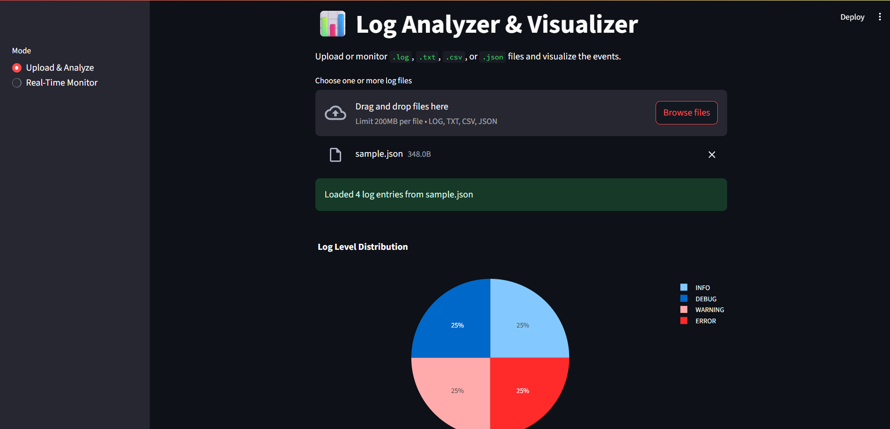

# Log Analyzer & Visualizer

A comprehensive log analysis and visualization tool built with Streamlit that supports multiple log formats and provides interactive visualizations.



---

## Features

- **Multiple Log Formats**: Supports `.log`, `.txt`, `.csv`, and `.json` files
- **Interactive Visualizations**: 
  - Log level distribution pie chart
  - Timeline visualization of log events
  - Real-time alerts for high event volumes
- **Data Export**: Export reports in Excel and CSV formats
- **File Upload**: Simple drag-and-drop file upload interface
- **Database Storage**: SQLite database for efficient log storage and querying

## Installation

1. Clone the repository:
   ```bash
   git clone https://github.com/AaYuSh11233/LogAnalyzer.git
   cd LogAnalyzer
   ```
2. Install dependencies:
   ```bash
   pip install -r requirements.txt
   ```

## Usage

### Running the Application

**Windows (PowerShell):**
```powershell
.\run.ps1
```

**Manual:**
```bash
streamlit run app.py
```

The application will be available at `http://localhost:8501`

### Using the Application

1. **Upload & Analyze Mode:**
   - Upload a log file using the file uploader
   - View visualizations and statistics
   - Export reports in Excel or CSV format

2. **Monitor Directory Mode:**
   - Monitor log files in a directory (coming soon)

### Log File Formats

**Text Log Format:**
```
2025-07-12 10:15:02 INFO User logged in
2025-07-12 10:16:00 ERROR Failed to connect
```

**CSV Format:**
```csv
timestamp,level,message
2025-07-12 10:15:02,INFO,User logged in
2025-07-12 10:16:00,ERROR,Failed to connect
```

**JSON Format:**
```json
{"timestamp": "2025-07-12T10:15:02", "level": "INFO", "message": "User logged in"}
{"timestamp": "2025-07-12T10:16:00", "level": "ERROR", "message": "Failed to connect"}
```

## File Structure

```
LogAnalyzer/
├── app.py              # Main Streamlit application
├── db.py               # Database operations
├── log_parser.py       # Log file parsing
├── utils.py            # Utility functions
├── visualizer.py       # Visualization functions
├── run.ps1             # PowerShell startup script
├── log_msr.ps1         # Log monitoring script
├── requirements.txt    # Python dependencies
├── logs/               # Sample log files
│   ├── sample.log
│   ├── sample.csv
│   └── sample.json
├── assets/
│   └── images/
│       └── demo.png    # Demo screenshot
└── README.md           # This file
```

## Dependencies

- **streamlit**: Web application framework
- **pandas**: Data manipulation and analysis
- **plotly**: Interactive visualizations
- **openpyxl**: Excel file export support

## Professional Workflow & Testing Guide

### 1. Setting Up the Environment
- Ensure Python 3.8+ is installed.
- (Optional) Create a virtual environment:
  ```bash
  python -m venv venv
  source venv/bin/activate  # On Windows: venv\Scripts\activate
  ```
- Install dependencies:
  ```bash
  pip install -r requirements.txt
  ```

### 2. Running the Application
- Use the provided PowerShell script for a one-step launch:
  ```powershell
  .\run.ps1
  ```
- Or run manually:
  ```bash
  streamlit run app.py
  ```
- Access the app at [http://localhost:8501](http://localhost:8501)

### 3. Testing the Application
- Upload sample log files from the `logs/` directory.
- Verify:
  - Visualizations render correctly (pie chart, timeline, alerts)
  - Export functionality (Excel, CSV) works
  - Database is created and populated
- For custom logs, ensure they match the supported formats.
- Check the console/Streamlit logs for errors.

### 4. Reporting Issues
- If you encounter a bug or unexpected behavior, please open an issue on the [GitHub Issues page](https://github.com/AaYuSh11233/LogAnalyzer/issues) with:
  - Steps to reproduce
  - Log file sample (if possible)
  - Screenshots or error messages

## Contributing

We welcome contributions! To contribute:
- Fork the repository
- Create a new branch for your feature or bugfix
- Submit a pull request with a clear description of your changes
- For major changes, please open an issue first to discuss your proposal

## Future Improvements

- Real-time directory monitoring
- Advanced filtering and search capabilities
- User authentication and role-based access
- Integration with cloud storage providers
- Enhanced alerting and notification system
- Support for additional log formats

---

For any questions or support, please open an issue or contact the maintainer via GitHub.
